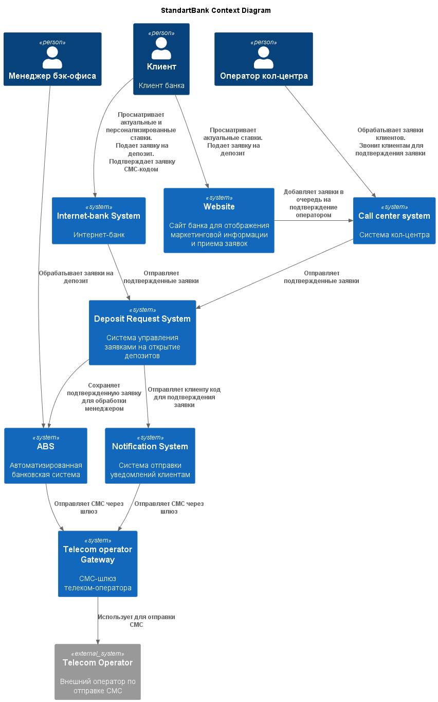
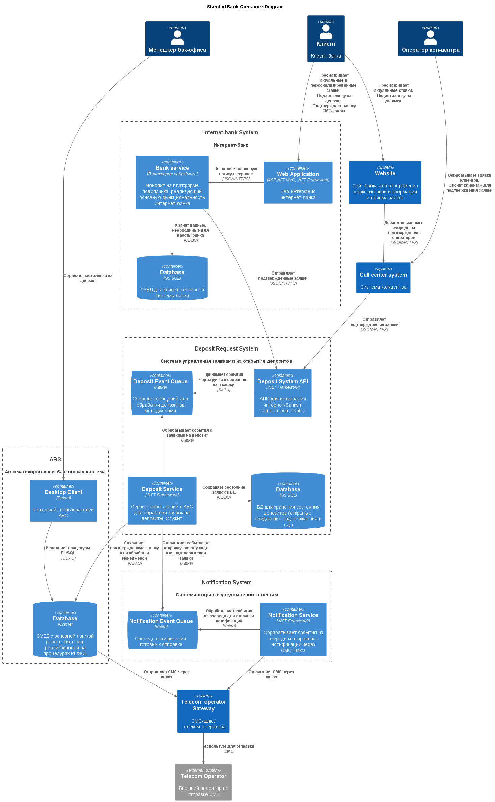

### **Название задачи: MVP открытия депозитов онлайн**
### **Автор: Максим**
### **Дата: 02.09.2025**
### **Функциональные требования**

Верхнеуровневые Use Cases:
|**№**|**Действующие лица или системы**|**Use Case**|**Описание**|
| :-: | :- | :- | :- |
| UC1 | Клиент, сайт | Подача заявки через сайт | 1. Клиент переходит на сайт банка.   2. Клиент видит список доступных депозитов с актуальными ставками.   3. Клиент вводит номер телефона и Ф.И.О. для подачи заявки на депозит.   4. Оператор кол-центра звонит клиенту для подтверждения.    5. Оператор кол-центра может предложить клиенту особые условия.   5. После звонка клиент приходит в отделение банка для проверки документов. |
| UC2 | Клиент, интернет-банк | Подача заявки через интернет-банк | 1. Клиент открывает интернет-банк.   2. Клиент видит список доступных депозитов с актуальными ставками, а также персонализированные ставки лично для него.   3. Клиент выбирает счёт и сумму желаемого депозита.   4. Клиенту приходит СМС-код для подтверждения.   5. Клиент вводит СМС-код в интернет-банке. |
| UC3 | Менеджер бэк-офиса, АБС | Подтверждение заявки на депозит | 1. Менеджер видит заявку на депозит от клиента в АБС.   2. Менеджер подтверждает условия депозита.   3. Клиент получает СМС-уведомление об открытии депозита с указанием размера ставки. |

### **Нефункциональные требования**

Нефункциональные требования и архитектурно значимые требования:

|**№**|**Требование**|
| :-: | :- |
| **R**   | **Надёжность (Reliability)** |
| R1  | Все сервисы должны работать 24/7. |
| R2  | Все сервисы должны быть доступны в 99,9% случаев. |
| R3  | В случае сбоев в ЦОД необходимо, чтобы сервисы интернет-банка были доступны и выдерживали требуемую нагрузку. |
| **P**   | **Производительность (Performance)**   |
| P1  | Отклик по всем операциям должен быть максимально быстрым и занимать миллисекунды. |
| P2  | Нужно предусмотреть равномерное горизонтальное масштабирование. |
| P3  | Нужно предусмотреть распределение запросов между серверами, приложениями и ЦОД. |
| **+R**  | **+ Ограничения (Restrictions)** |
| +R1 | Для базы данных лучше использовать MS SQL или Oracle |
| +R2 | Для бэкенда лучше использовать .NET Framework или PHP |
| +R3 | Для веб-интерфейса лучше использовать React.js |
| +R4 | Если нужны очереди сообщений, то лучше использовать Kafka на перспективу. |
| +R5 | Нужно учитывать, что АБС может масштабироваться только вертикально из-за своей базы данных. |
| +R6 | На сайте и в интернет-банке передачу данных необходимо защищать с помощью механизма шифрования трафика. |
| +R7 | Функционал работы с СМС реализован в ядре системы. Он требует доработки со стороны подрядчика, но этого лучше избежать. |

### **Решение**

Диаграмма контекста выглядит следующим образом:

На ней добавлены две новые системы: Deposit Request system и Notification system.

#### Deposit Request system
Система отвечает за управление заявками на депозит. Она поддерживает
актуальный статус заявки, а также обновляет его, исходя из внешних
событий.

Система может отправлять в АБС подтвержденную заявку на депозит, чтобы
менеджер бэк-офиса продолжал с ней работу в привычной для себя среде.

#### Notification system
Система нотификаций нужна для удовлетворения такому архитектурному
требованию:
> Функционал работы с СМС реализован в ядре системы. Он требует
  доработки со стороны подрядчика, но этого лучше избежать.
  Реализовать такой бизнес-функционал можно силами команды разработки банка.

Также она предусматривает возможность масштабирования отправки
СМС-сообщений через несколько шлюзов, если такое в будущем случится.

Теперь приведем более подробную диаграмму контейнеров:

API перед кафкой в Deposit Request System существует для
удовлетворения требованию:
> Если нужны очереди сообщений, то лучше использовать Kafka на
  перспективу. Правда, стоит учитывать, что текущая версия платформы
  интернет-банка несовместима с ней.

Для бэкенда в новых сервисах используется `.NET Framework`, в котором
у команды разработчиков банка уже есть опыт. С такой же идеей выбрана
и база данных `MS SQL`.

### **Альтернативы**

Во-первых, можно было не добавлять отдельный сервис для отправки
СМС-сообщений. Но тогда пришлось бы использовать существующую
логику в ядре системы, что потребовало бы доработки со стороны
подрядчика.

Во-вторых, можно было отказаться от использования очереди сообщений
в системе Deposit Request. Однако, в таком случае система бы еще
сложнее масштабировалась горизонтально.

Также, можно было рассмотреть вариант с использованием `gRPC`, но с
этой технологией у команды совсем нет опыта. Соответственно, такой
выбор хоть и имеет преимущества, но скорее всего значительно увеличил
бы затраты ресурсов на разработку.

**Недостатки, ограничения, риски**

Масштабирование системы все еще значительно упирается в БД АБС.
Так как она масштабируется только вертикально, никакие очереди
сообщений не спасут её от роста нагрузки.

Также шлюз для отправки СМС-сообщений представляет собой единую точку
отказа системы. Благодаря очереди сообщений в сервисе нотификаций,
его падение не повлияет на систему целиком, но при этом клиенты
не будут получать СМС-подтверждения при использовании интернет-банка.
Стоит рассмотреть масштабирование шлюза или использование нескольких
телеком-операторов в случае роста нагрузки на систему.

Могут быть сложности с интеграцией партнерского кол-центра в текущую
систему, т.к. мы добавляем новые API для работы операторов.
