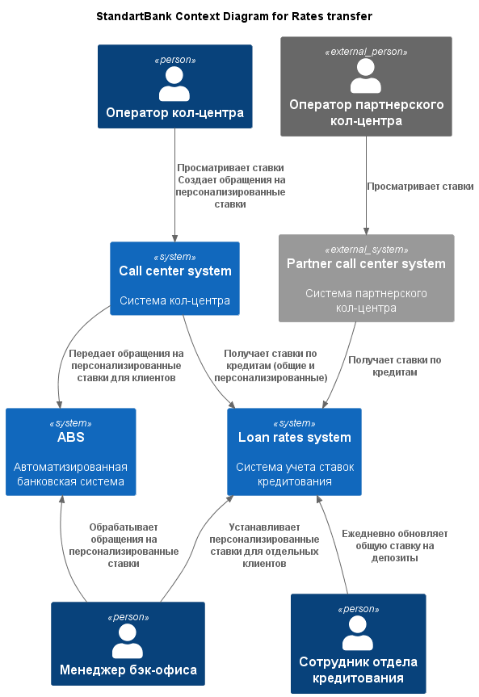
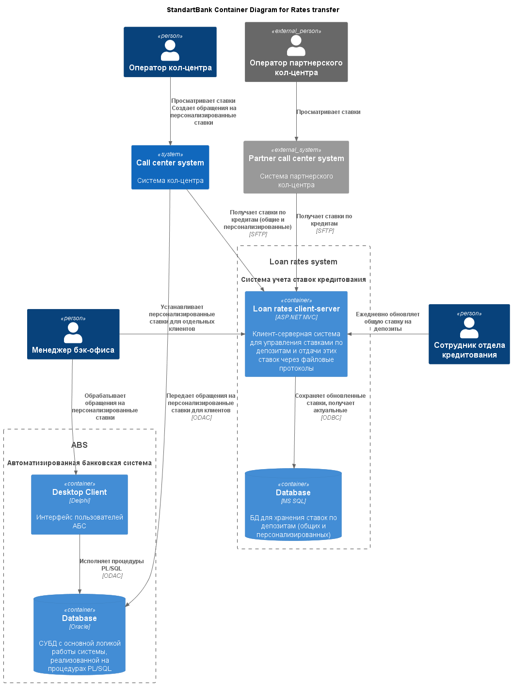

### **Название задачи: Передача ставок в кол-центр**
### **Автор: Максим**
### **Дата: 04.09.2025**
### **Функциональные требования**

Верхнеуровневые Use Cases:
|**№**|**Действующие лица или системы**|**Use Case**|**Описание**|
| :-: | :- | :- | :- |
| UC1 | Клиент, кол-центр | Клиент уточняет ставку через кол-центр | 1. Клиент звонит в банк для уточнения ставки.   2. Звонок обрабатывается кол-центром банка.   3. Оператор кол-центра проверяет ставки по депозитам в своей системе.   4. Оператор кол-центра сообщает клиенту актуальные ставки по депозитам. |
| UC2 | Клиент, партнерский кол-центр | Клиент уточняст ставку через партнерский кол-центр | 1. Клиент звонит в банк для уточнения ставки.   Звонок обрабатывается партнерским кол-центром.   3. Оператор проверяет ставки в системе партнерского кол-центра.   4. Оператор партнерского кол-центра сообщает клиенту актуальные ставки по депозитам. |

### **Нефункциональные требования**

Нефункциональные требования и архитектурно значимые требования:

|**№**|**Требование**|
| :-: | :- |
| **R**   | **Надёжность (Reliability)** |
| R1  | Все сервисы должны работать 24/7. |
| R2  | Все сервисы должны быть доступны в 99,9% случаев. |
| R3  | В случае сбоев в ЦОД необходимо, чтобы сервисы интернет-банка были доступны и выдерживали требуемую нагрузку. |
| **P**   | **Производительность (Performance)**   |
| P1  | Отклик по всем операциям должен быть максимально быстрым и занимать миллисекунды. |
| P2  | Нужно предусмотреть равномерное горизонтальное масштабирование. |
| P3  | Нужно предусмотреть распределение запросов между серверами, приложениями и ЦОД. |
| **+R**  | **+ Ограничения (Restrictions)** |
| +R1 | Для базы данных лучше использовать MS SQL или Oracle |
| +R2 | Для бэкенда лучше использовать .NET Framework или PHP |
| +R3 | Для веб-интерфейса лучше использовать React.js |
| +R4 | Если нужны очереди сообщений, то лучше использовать Kafka на перспективу. |
| +R5 | Нужно учитывать, что АБС может масштабироваться только вертикально из-за своей базы данных. |
| +R6 | На сайте и в интернет-банке передачу данных необходимо защищать с помощью механизма шифрования трафика. |
| +R7 | Функционал работы с СМС реализован в ядре системы. Он требует доработки со стороны подрядчика, но этого лучше избежать. |

### **Решение**

Диаграмма контекста:

В рамках решения добавляем новую систему, которая будет
мастер-системой для хранения актуальных ставок.

Сотрудник отдела кредитования ежедневно будет вносить в эту систему
актуальные ставки по депозитам, используемые для всех клиентов.

Также остается флоу с персонализированными ставками. По запросу
клиента оператор кол-центра может создать обращение в своей системе,
которое передается в АБС. Далее, менеджер бэк-офиса рассмотрит это
обращение и при необходимости внесет в систему управления ставками
персонализированную ставку для клиента.

В базе данных система будет поддерживать актуальные ставки, а также
генерировать файлы для отправки через `SFTP` и передавать их по
запросу системам кол-центров.

Более подробно решение описано на диаграмме контейнеров:

### **Альтернативы**

Как вариант, можно было не добавлять базу данных, а сразу хранить
ставки по кредитам в файловом виде, который могут принимать системы
кол-центров. Однако, это решение лишает нас гибкости при работе
с кол-центрами. Внесение изменений в систему партнерского кол-центра
невозможно с нашей стороны, поэтому лучше иметь возможность легко
изменять формат файлов экспорта.

Можно было оставить управление ставками в АБС, но это создало бы
дополнительную нагрузку на систему, которая и без того тяжело
масштабируется (только вертикально). При росте обращений по телефону
это привело бы и к росту нагрузки на АБС, чего допускать нельзя.

Альтернативно, можно было сделать отдельное API для системы кол-центра
банка, т.к. в нее мы можем вносить изменения. Но во-первых, это заняло
бы время, хоть и некоторые разработчики имеют опыт в Java-стеке.
Во-вторых, возникли бы дополнительные сложности для масштабирования.

**Недостатки, ограничения, риски**

Из недостатков можно выделить необходимость масштабировать
горизонтально целиком всю клиент-серверную систему учета ставок.
Могут возникнуть сложности в этом моменте, а также можем упереться
в БД.
